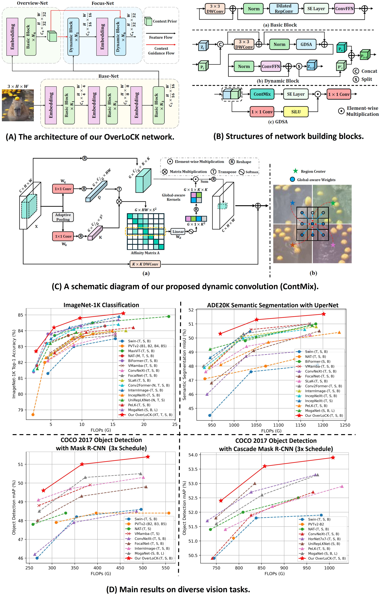

# [[CVPR 2025] OverLoCK: An Overview-first-Look-Closely-next ConvNet with Context-Mixing Dynamic Kernels](https://arxiv.org/abs/2502.20087)

This is an official PyTorch implementation of "[OverLoCK: An Overview-first-Look-Closely-next ConvNet with Context-Mixing Dynamic Kernels](https://arxiv.org/abs/2502.20087)".

# Introduction
In the human vision system, top-down attention plays a crucial role in perception, wherein the brain initially performs an overall but rough scene analysis to extract salient cues (i.e., overview first), followed by a finer-grained examination to make more accurate judgments (i.e., look closely next). However, recent efforts in ConvNet designs primarily focused on increasing kernel size to obtain a larger receptive field without considering this crucial biomimetic mechanism to further improve performance. To this end, we propose a novel pure ConvNet vision backbone, termed OverLoCK, which is carefully devised from both the architecture and mixer perspectives. Specifically, we introduce a biomimetic Deep-stage Decomposition Strategy (DDS) that fuses semantically meaningful context representations into middle and deep layers by providing dynamic top-down context guidance at both feature and kernel weight levels. To fully unleash the power of top-down context guidance, we further propose a novel Context-Mixing Dynamic Convolution (ContMix) that effectively models long-range dependencies while preserving inherent local inductive biases even when the input resolution increases. These properties are absent in previous convolutions. With the support from both DDS and ContMix, our OverLoCK exhibits notable performance improvement over existing methods.
<center> 

</center>

# Image Classification

## 1. Requirements
We highly suggest using our provided dependencies to ensure reproducibility:
```
# Environments:
cuda==12.1
python==3.10
# Packages:
torch==2.3.1
timm==0.6.12
natten==0.17.1
depthwise_conv2d_implicit_gemm==0.0.0
```

## 2. Data Preparation
Prepare [ImageNet](https://image-net.org/) with the following folder structure, you can extract ImageNet by this [script](https://gist.github.com/BIGBALLON/8a71d225eff18d88e469e6ea9b39cef4).

```
│imagenet/
├──train/
│  ├── n01440764
│  │   ├── n01440764_10026.JPEG
│  │   ├── n01440764_10027.JPEG
│  │   ├── ......
│  ├── ......
├──val/
│  ├── n01440764
│  │   ├── ILSVRC2012_val_00000293.JPEG
│  │   ├── ILSVRC2012_val_00002138.JPEG
│  │   ├── ......
│  ├── ......
```

## 3. Main Results on ImageNet-1K with Pretrained Models

| Models      | Input Size | FLOPs (G) | Params (M) | Top-1 (%) | Download |
|:-----------:|:----------:|:---------:|:----------:|:----------:|:----------:|
| OverLoCK-XT | 224x224    | 2.6       | 16       | 82.7       | [model](https://github.com/LMMMEng/OverLoCK/releases/download/v1/overlock_xt_in1k_224.pth)     |
| OverLoCK-T | 224x224    | 5.5       | 33      | 84.2       | [model](https://github.com/LMMMEng/OverLoCK/releases/download/v1/overlock_t_in1k_224.pth)     |
| OverLoCK-S | 224x224    | 9.7      | 56       | 84.8       | [model](https://github.com/LMMMEng/OverLoCK/releases/download/v1/overlock_s_in1k_224.pth)     |
| OverLoCK-B | 224x224    | 16.7       | 95       | 85.1       | [model](https://github.com/LMMMEng/OverLoCK/releases/download/v1/overlock_b_in1k_224.pth)     |

## 4. Train
To train ```OverLoCK``` models on ImageNet-1K with 8 gpus (single node), run:
```
bash scripts/train_xt_model.sh # train OverLoCK-XT
bash scripts/train_t_model.sh  # train OverLoCK-T
bash scripts/train_s_model.sh  # train OverLoCK-S
bash scripts/train_b_model.sh  # train OverLoCK-B
```

## 5. Validation
To evaluate ```OverLoCK``` on ImageNet-1K, run:
```
MODEL=overlock_xt # overlock_{xt, t, s, b}
python3 validate.py \
/path/to/imagenet \
--model $MODEL -b 128 \
--pretrained # or --checkpoint /path/to/checkpoint 
```

# Object Detection and Semantic Segmentation
Code is currently being cleaned up. Please stay tuned.

# Citation
If you find this project useful for your research, please consider citing:
```
@article{lou2025overlock,
  title={OverLoCK: An Overview-first-Look-Closely-next ConvNet with Context-Mixing Dynamic Kernels},
  author={Meng Lou and Yizhou Yu},
  journal={arXiv preprint arXiv:2502.20087},
  year={2025}
}
```

# Acknowledgment
Our implementation is mainly based on the following codebases. We gratefully thank the authors for their wonderful works.  
> [timm](https://github.com/rwightman/pytorch-image-models), [natten](https://github.com/SHI-Labs/NATTEN), [unireplknet](https://github.com/AILab-CVC/UniRepLKNet), [mmcv](https://github.com/open-mmlab/mmcv) [mmdet](https://github.com/open-mmlab/mmdetection), [mmseg](https://github.com/open-mmlab/mmsegmentation)  

# Contact
If you have any questions, please feel free to [create issues❓](https://github.com/LMMMEng/OverLoCK/issues) or [contact me 📧](lmzmm.0921@gmail.com).